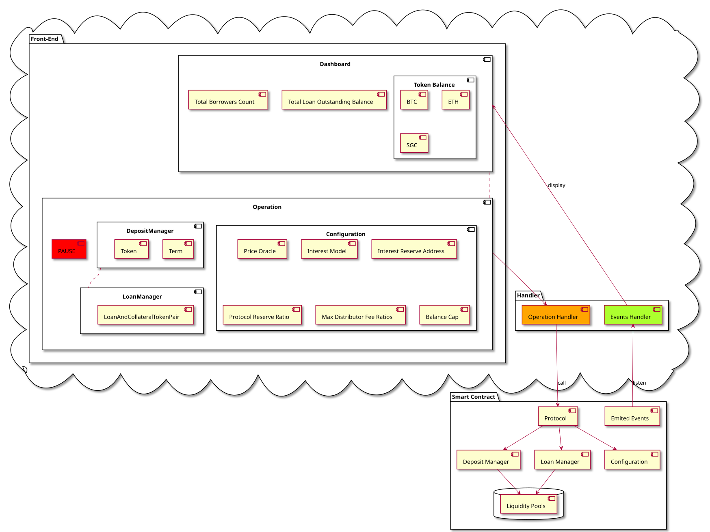
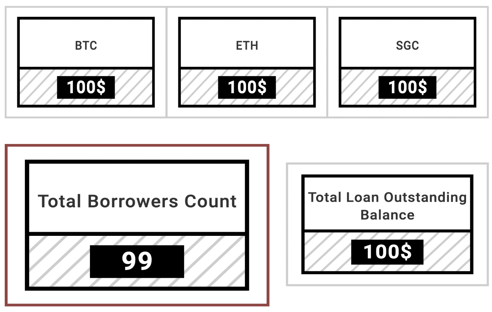

# CONTENTS
- [CONTENTS](#contents)
- [1. INTRODUCTION](#1-introduction)
  - [1.1 Purpose](#11-purpose)
  - [1.2 Backend Stats](#12-backend-stats)
- [2. DATA DESIGN](#2-data-design)
  - [2.1 Configuration](#21-configuration)
  - [2.2 DepositManager](#22-depositmanager)
  - [2.3 LoanManager](#23-loanmanager)
  - [2.4 LiquidityPools](#24-liquiditypools)
- [3. ARCHITECTURE AND COMPONENT-LEVEL DESIGN](#3-architecture-and-component-level-design)
- [4. USER INTERFACE DESIGN](#4-user-interface-design)
  - [4.1 Dashboard](#41-dashboard)
  - [4.2 Operation](#42-operation)
    - [4.2.1 Pause & Unpause](#421-pause--unpause)
    - [4.2.2 Deposit Management](#422-deposit-management)
      - [4.2.2.1 EnableDepositTerm & DisableDepositTerm](#4221-enabledepositterm--disabledepositterm)
      - [4.2.2.2 EnableDepositToken & DisableDepositToken](#4222-enabledeposittoken--disabledeposittoken)
    - [4.2.2 Loan Management](#422-loan-management)
      - [4.2.2.1 SetLoanAndCollateralTokenPair & RemoveLoanAndCollateralTokenPair](#4221-setloanandcollateraltokenpair--removeloanandcollateraltokenpair)
    - [4.2.3 Configuration](#423-configuration)
      - [4.2.3.1 SetPriceOracle](#4231-setpriceoracle)
      - [4.2.3.2 SetInterestModel](#4232-setinterestmodel)
      - [4.2.3.3 SetInterestReserveAddress](#4233-setinterestreserveaddress)
      - [4.2.3.4 SetProtocolReserveRatio](#4234-setprotocolreserveratio)
      - [4.2.3.5 SetMaxDistributorFeeRatios](#4235-setmaxdistributorfeeratios)
      - [4.2.3.6 SetBalanceCap](#4236-setbalancecap)
  - [4.3 Keeper](#43-keeper)
    - [4.3.1 Margin Call History](#431-margin-call-history)
    - [4.3.2 Liquidation](#432-liquidation)


# 1. INTRODUCTION
## 1.1 Purpose
There is a backend management system used by system administrators to collect system statistics such as total collateral, total loan balance, collateral and balance for each user, and these stats can be queried by lender IT systems through a set of APIs.  
## 1.2 Backend Stats
- Total BTC balance
- Total ETH balance
- Total SGC balance
- Total loan outstanding balance
- Total Borrower count
- Each Borrower collateral and loan balance


# 2. DATA DESIGN
## 2.1 Configuration
```
    struct State {
        // The percentage deposit distributor takes from deposit interest as reward
        uint256 depositDistributorFeeRatio;
        // The percentage loan distributor takes from deposit interest as reward
        uint256 loanDistributorFeeRatio;
        // The percentage protocol takes from deposit interest as profit
        uint256 protocolReserveRatio;
        // The address where the protocol sends earned profit to
        address payable interestReserveAddress;
        // Token address -> price oracle
        mapping(address => IPriceOracle) priceOracleByToken;
        // Token address -> maximum token balance allowed
        mapping(address => uint256) balanceCapByToken;
        IInterestModel interestModel;
    }
```
## 2.2 DepositManager
```
    struct State {
        // Total number of deposits
        uint256 numDeposits;
        // Enabled deposit terms
        uint256[] depositTermList;
        // Enabled deposit tokens
        address[] depositTokenAddressList;
        // Deposit term -> enabled?
        mapping(uint256 => bool) isDepositTermEnabled;
        // Deposit token -> enabled?
        mapping(address => bool) isDepositTokenEnabled;
        // ID -> DepositRecord
        mapping(bytes32 => IStruct.DepositRecord) depositRecordById;
        // AccountAddress -> DepositIds
        mapping(address => bytes32[]) depositIdsByAccountAddress;
    }
```

## 2.3 LoanManager
```
    struct State {
        // Total number of loans
        uint256 numLoans;
        // Loan ID -> LoanRecord
        mapping(bytes32 => IStruct.LoanRecord) loanRecordById;
        // accountAddress -> loanIds
        mapping(address => bytes32[]) loanIdsByAccount;
        // loanTokenAddress -> collateralTokenAddress -> LoanAndCollateralTokenPair
        mapping(address => mapping(address => IStruct.LoanAndCollateralTokenPair)) loanAndCollateralTokenPairs;
        // Enabled list of token pairs
        IStruct.LoanAndCollateralTokenPair[] loanAndCollateralTokenPairList;
    }
```
## 2.4 LiquidityPools
```
    struct State {
        // Token -> PoolGroup
        mapping(address => PoolGroup) poolGroups;
        // Number of pools in a PoolGroup
        uint256 poolGroupSize;
    }

    /// A PoolGroup essentially assigns a Pool, where liquidity info is recorded,
    /// to each day (converted from `block.timestamp`). For example, when a deposit
    /// happens, we calculate the day we want to deposit into based on the deposit
    /// term, then we record deposit amount in the Pool data structure.
    struct PoolGroup {
        // Pool ID (in day) -> Pool
        mapping(uint256 => IStruct.Pool) poolsById;
        // Loan ID -> Pool ID -> Borrow amount
        mapping(bytes32 => mapping(uint256 => uint256)) loanAmountByLoanIdAndPoolId;
        // Loan ID -> Pool IDs
        mapping(bytes32 => uint256[]) matchedPoolIdsByLoanId;
    }
```

# 3. ARCHITECTURE AND COMPONENT-LEVEL DESIGN


# 4. USER INTERFACE DESIGN
## 4.1 Dashboard

*As shown in the figure above, Dashboard shows:*
- Total BTC balance
- Total ETH balance
- Total SGC balance
- Total loan outstanding balance
- Total Borrowers count

*When we click on the **Total Borrowers Count component**, a new page will open with a list showing:*
- Each Borrower collateral and loan balance
 
*The list will be lazy loaded.*

## 4.2 Operation
### 4.2.1 Pause & Unpause
*When administrator click the button with pause icon and green background color, the button icon change to forward icon and background color changes to red.*

### 4.2.2 Deposit Management
#### 4.2.2.1 EnableDepositTerm & DisableDepositTerm
*When the administrator clicks this module, a new page is opened. In the new page, there will be an input box for you to input the deposit term or deposit terms array.*

#### 4.2.2.2 EnableDepositToken & DisableDepositToken
*When the administrator clicks this module, a new page is opened. In the new page, there will be an input box for you to input the deposit token address, and a list of all enabled tokens with disable button will be displayed below the input box. In addition, a search bar should be added to the input box and list to search for tokens in the list, and the list field can display filtered results.*

### 4.2.2 Loan Management
#### 4.2.2.1 SetLoanAndCollateralTokenPair & RemoveLoanAndCollateralTokenPair
*When the administrator clicks this module, a new page is opened. The upper part of this page will display the input box for adding loan and collateral token pairs, and the rest of the page will display all loan and collateral token pairs that have been set up. Every pairs can be removed by clicking remove button after pairs displayed field.*

### 4.2.3 Configuration
#### 4.2.3.1 SetPriceOracle
*When we click on the SetPriceOracle module, a pair of input boxes are displayed, the first input box prompts for input Token Address, and the second input box prompts for input Token Price Oracle Address. Additionally, administrator can add new token-oracle pairs bellow the setted pair.*

#### 4.2.3.2 SetInterestModel
*When we click on the SetInterestReserveAddress module, the input box will appear, and we can input the address to complete the setting.*

#### 4.2.3.3 SetInterestReserveAddress
*When we click on the SetInterestReserveAddress module, the input box will appear, and we can input the address to complete the setting.*

#### 4.2.3.4 SetProtocolReserveRatio
*When we click on the SetProtocolReserveRatio module, the input box will appear, and we can input the ratio to complete the setting.*

#### 4.2.3.5 SetMaxDistributorFeeRatios
*When we click on the SetMaxDistributorFeeRatios module, two lines of input box will appear. The first line prompts for input Deposit Distributor Fee Ratio, and the second line prompts for input Loan Distributor Fee Ratio.*

#### 4.2.3.6 SetBalanceCap
*When we click on the SetMaxDistributorFeeRatios module, two lines of input box will appear. The first line prompts for input Token Address, and the second line prompts for input Balance Cap.*

## 4.3 Keeper
### 4.3.1 Margin Call History

### 4.3.2 Liquidation